# PI3-2025-1

# DryShield

Alunos: Diana Macedo, Giovanna Liz, Sarah Bararua

## Resumo

Estender roupas em áreas externas é uma prática comum, porém altamente vulnerável às mudanças repentinas do clima. Muitos moradores enfrentam frustrações ao verem suas roupas molhadas por chuvas inesperadas, além do desgaste de precisar retirá-las às pressas ou reorganizar o varal repetidamente. Este projeto propõe uma solução automatizada e inteligente que visa minimizar esse transtorno, oferecendo um sistema capaz de proteger as roupas de forma autônoma e eficiente. A proposta combina monitoramento climático em tempo real e tomada de decisão automatizada, criando uma estrutura capaz de responder tanto à previsão do tempo quanto às condições ambientais detectadas no momento. Com isso, o sistema não apenas previne danos e retrabalhos, como também agrega praticidade, economia de tempo e conforto ao cotidiano dos usuários. O projeto se insere no contexto da automação residencial acessível, explorando conceitos de inteligência embarcada e conectividade para resolver um problema real com eficiência e simplicidade.

## Introdução

## Metodologia

## Fluxograma 

  

## Estudo sobre Aspectos de Inteligência
  
* Sensoriamento ambiental: uso de sensores de chuva para detectar mudanças nas condições climáticas em tempo real.

* Tomada de decisão automatizada: a lógica embarcada no microcontrolador avalia as condições do ambiente e da previsão do tempo para acionar mecanismos de proteção automaticamente, como o fechamento da tenda e o acionamento do aquecedor.

* Previsão de eventos: ao integrar uma verificação automática da previsão do tempo, o sistema antecipa situações de risco (como chuva iminente), aumentando a eficiência do controle.

* Conectividade e interação remota: o uso do módulo Wi-Fi permite controle via aplicativo, monitoramento em tempo real e possível integração com assistentes virtuais ou outros dispositivos IoT no futuro.

* Eficiência energética: o sistema só aciona dispositivos como o aquecedor quando necessário, otimizando o uso de energia e aumentando a vida útil dos componentes.

 ## Diagrama de Blocos

  

 ## Sensores
  
  - Sensor de chuva YL-83: Detecta presença de água. Principal sensor, com base nele o toldo vai abrir ou fechar. 
 

  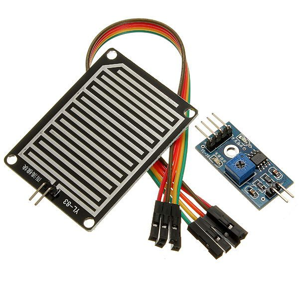

    
  - Acelerômetro (MPU-6050): Detecta quando há quedas ou inclinações. Quando o varal se move, inclina ou cai, as medidas dos eixos mudam rapidamente e assim é avisado que algo ocorreu.

  

  
## Atuadores
    
- Motor 5.9V : Vai ter a função de abrir e fechar o toldo.
 

  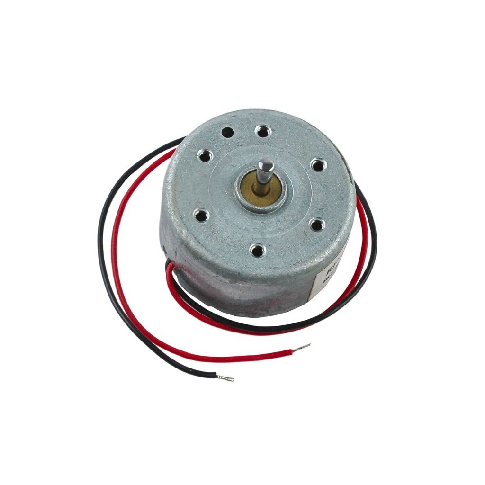

- Módulo relé 4 canais : Vai ser utilizados com o objetivo de fazer o esp controlar os motores e o aquecedor ptc.
 

  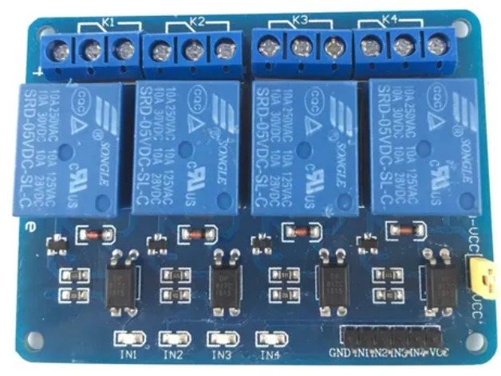

- Aquecedor PTC 12V: Aquecedor vai ser ativado após o fechamento do toldo para que continue secando as roupas. Gera calor logo após ser ligado na alimentação, podendo chegar até 200°C porém muito lentamente.

  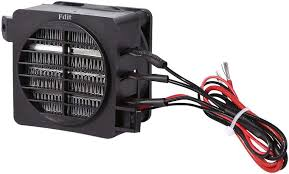

  
## Estrutura Mecânica
  
A estrutura consiste em um toldo retrátil, acionado por motor de passo com braços articulados ou trilhos. O varal é fixado de forma estável e sensores são posicionados para proteção contra água e detecção de anomalias.

## Definição do Processador
O ESP32 foi escolhido por ter Wi-Fi integrado, múltiplas interfaces GPIO, suporte a ADC e I2C, capacidade de processamento adequada e consumo energético eficiente. Conseguindo assim atingir todos os pré requisitos estabelecidos no projeto.

  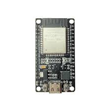

## Fluxograma do comportamento do sistema

  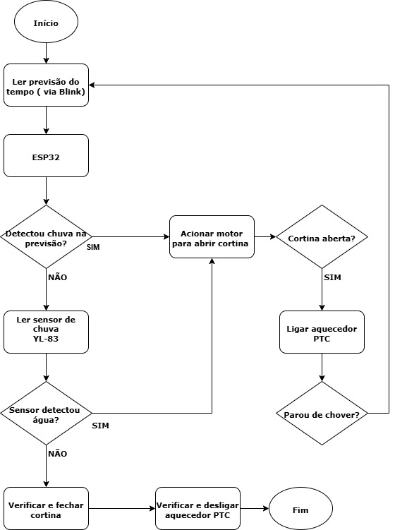

## Testes iniciais dos sensores

Foram realizados testes individuais de cada sensor para verificar seu funcionamento. O módulo de tensão, o acelerômetro e o sensor de chuva foram avaliados separadamente, sendo que o módulo de tensão e o acelerômetro apresentaram seus resultados por meio do monitor serial.

Teste inicial do Módulo de Tensão:

https://github.com/user-attachments/assets/a1b5b0d0-355b-4a44-a402-4f0e2d8aa150

Teste inicial do Acelerômetro:

https://github.com/user-attachments/assets/a39f9e20-5d1d-4470-aab8-4f512680a43d

Teste inicial do Sensor de Chuva:

https://github.com/user-attachments/assets/b8497144-41e5-45c0-88ff-a969a148b5c5

## Programação inicial e verificação com integração com os sensores

Após a validação individual de cada sensor, iniciou-se a fase de programação integrada do projeto. Nesta etapa, os sensores de chuva e o acelerômetro foram conectados simultaneamente ao ESP32, com a montagem realizada em uma protoboard, conforme mostrado na imagem abaixo. O objetivo foi desenvolver a lógica inicial de detecção de eventos relevantes: chuva e possível queda ou tombamento do varal.

  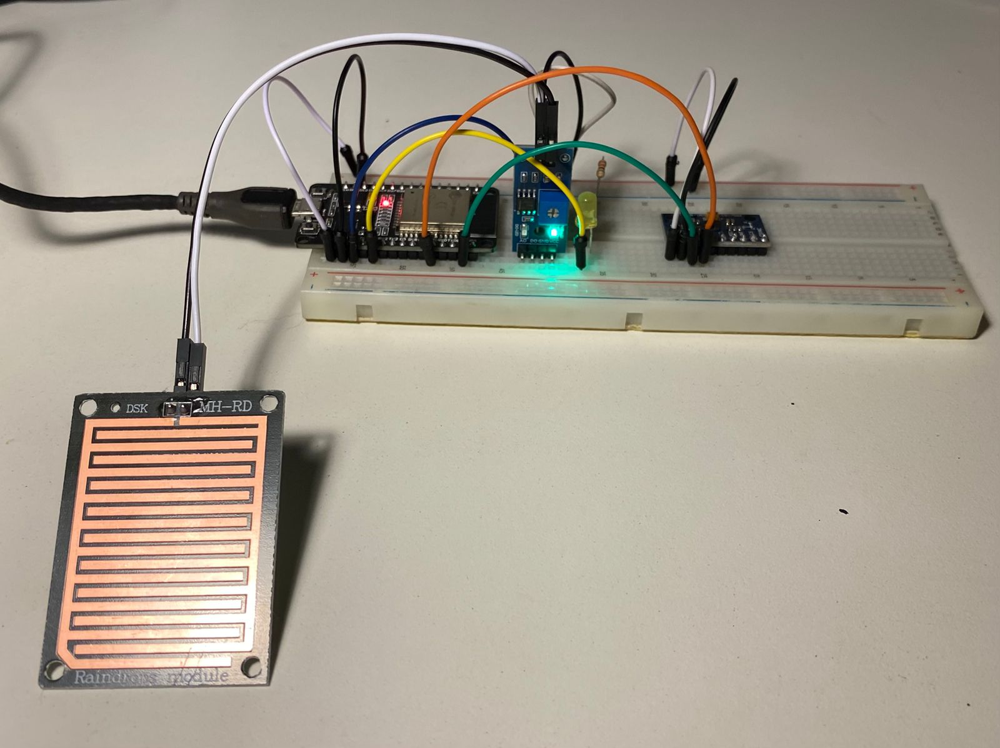

  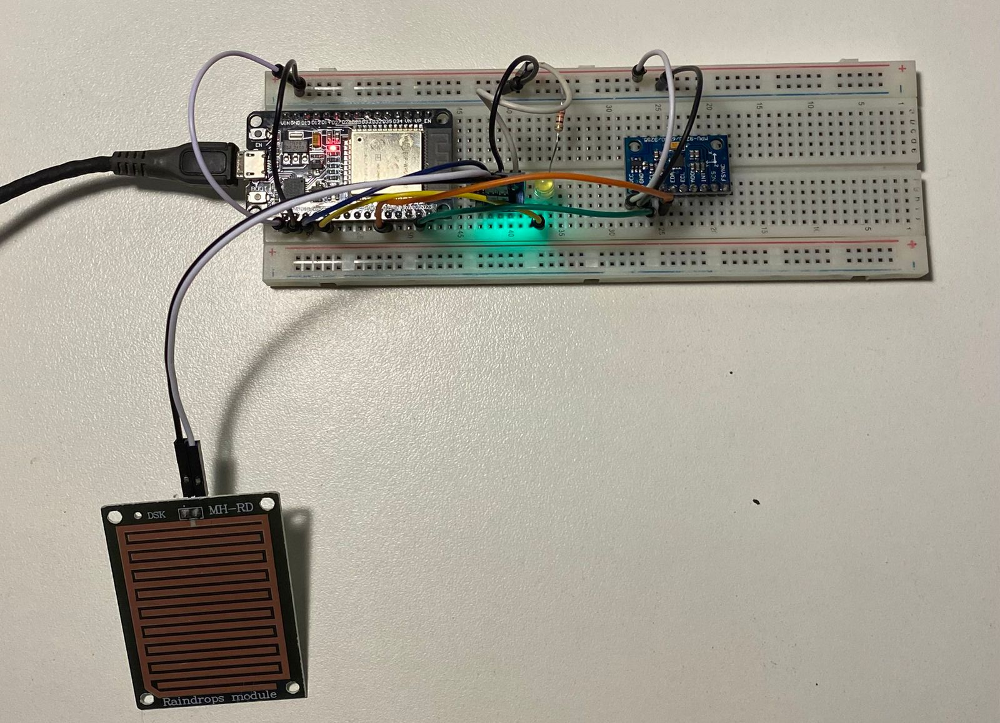

 A partir das leituras dos sensores, mensagens de alerta são exibidas no monitor serial indicando a presença de chuva ou alterações nos ângulos de inclinação que sugerem instabilidade do varal. 

Com os sensores de chuva e de inclinação já integrados e funcionando conforme o esperado. Esse módulo opera com um divisor resistivo interno, permitindo a leitura de tensões mais altas por meio da entrada analógica do ESP32. A adição deste sensor tem como finalidade monitorar a alimentação do sistema, identificando quedas de tensão ou falhas de fornecimento que possam comprometer o funcionamento do varal. Como mostra a figura a seguir:

 

  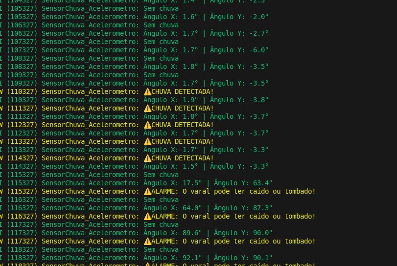

  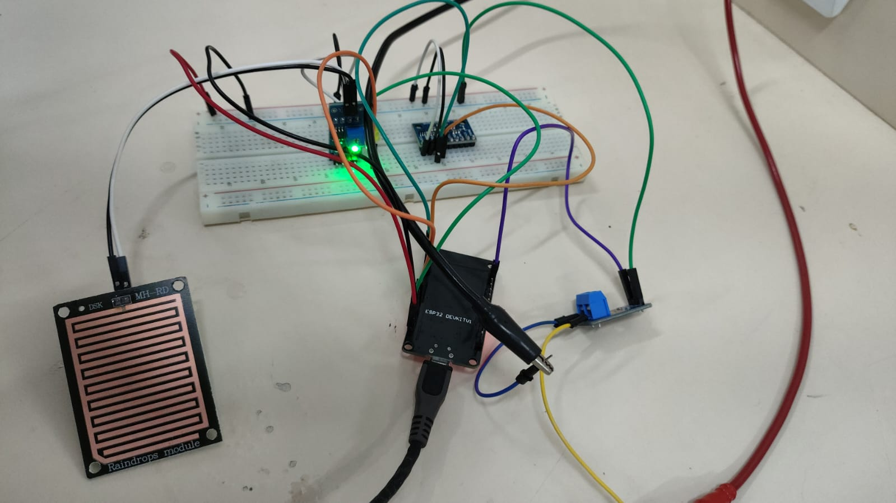

  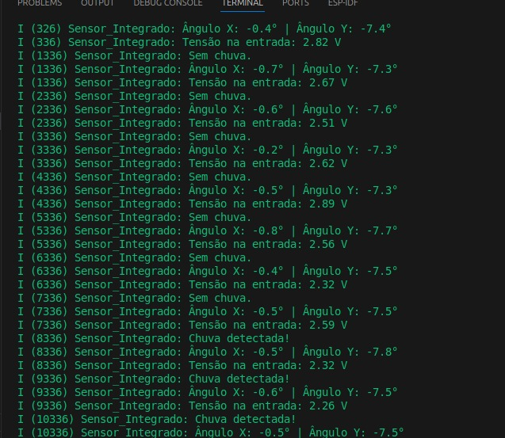

## Definição da interface com o usuário

Foi desenvolvido um protótipo da interface de comunicação com o usuário utilizando a plataforma Blynk. O Blynk é uma ferramenta que permite a criação de dashboards personalizáveis para monitoramento e interação com dispositivos inteligentes. Para este protótipo, foram configurados painéis tanto para acesso móvel, com o aplicativo disponível na App Store e Play Store, quanto para acesso via navegador, através do Blynk Web Dashboard, facilitando a visualização das informações do sistema em diferentes dispositivos.

### Blynk Web Dashboard

  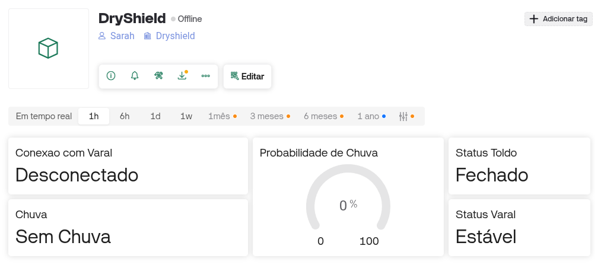

### Blink Mobile Dashboard

  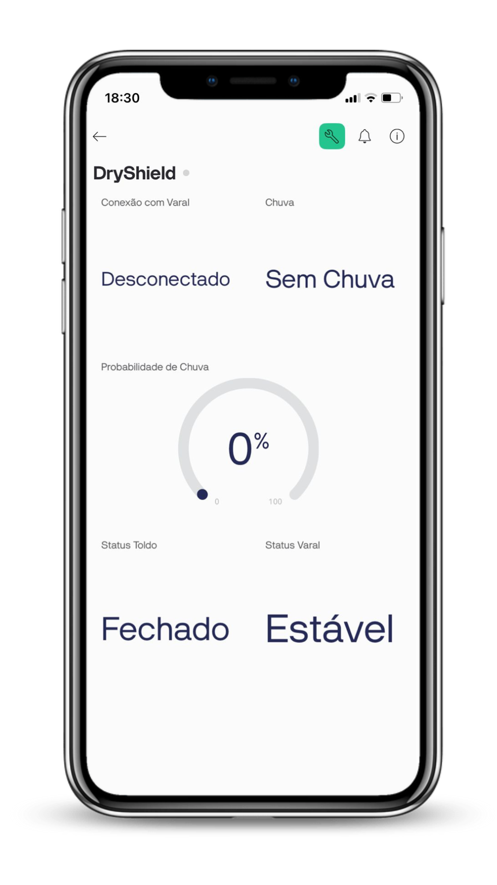

## Testes preliminares dos sensores e atuadores
Foram realizados testes isoladamente de cada motor, do aquecedor sozinho e depois o mesmo com a ventoinha. 

Teste motor 1: Teste realizados apenas com esp32, relé e o motor.

https://github.com/user-attachments/assets/6216d324-cf8a-46f8-abe0-dfbe666b14d1

Teste motor 2: Teste realizados apenas com esp32, relé e o motor.

https://github.com/user-attachments/assets/f46bb684-a913-4610-92dc-a691eb5c6a05

Teste aquecedor: Teste realizados apenas com esp32, relé e o aquecedor.

https://github.com/user-attachments/assets/ad0795f3-a723-4de0-9a04-a8e7355d2980

Teste aquecedor e ventoinha: Teste realizados apenas com esp32, relé, aquecedor e ventoinha fazendo ligar ambos ao mesmo tempo.

https://github.com/user-attachments/assets/a80e9e50-3602-43b4-a0d8-00919ef7b718

## Integração os componentes em um protótipo em bancada

Teste dos motores e sensores em conjunto: Neste teste ligamos os motores no módulo relé e no esp32, nele podemos observar se a lógica de ativação está correta. Foi realizado da seguinte maneira: Quando detectado chuva o motor 1 liga por 10s, após os 10s ambos os motores ficam desligados e o motor 2 somente liga quando detectar que parou a chuva e este também fica ligado por 10s.

https://github.com/user-attachments/assets/bebdd496-b92b-49b1-9776-2e549a879597

Teste da bancada completa: Neste teste todos os sensores e atuadores serão ligados, o sensor de tensão e o acelerômetro ficam constantemente ativos e mandando mensagem para o esp32, o sensor de chuva também fica monitorando o tempo todo porém, quando este detecta chuva o motor 1 é ligado por 10s, somente quando o motor 1 termina seu ciclo é que são ligadas a ventoinha e o aquecedor que permanecem ligados. Assim que é detectado que parou de chover o motor 2 é acionado também por 10s e quando completado este ciclo a ventoinha e o aquecedor juntamente a ele irão desligar.

https://github.com/user-attachments/assets/e433fd9b-2932-4dfc-9582-c2d3f96f4e4c

[demonstração do teste bancada completa - Monitor Serial](./Monitor_Motores_PTC.mp4)

## Implementação preliminar da interface do usuário

Após a criação dos layouts no aplicativo Blynk, iniciamos a comunicação do microcontrolador com o app. O ESP32 conecta-se à internet via Wi-Fi e utiliza um token de autenticação exclusivo (BLYNK_AUTH_TOKEN) para se comunicar com o projeto no Blynk. Em operação contínua, ele lê os sensores de chuva e o acelerômetro, enviando os dados em tempo real para a nuvem, que atualiza a interface do usuário de forma imediata e intuitiva.

[demonstração do Blynk](./VideoBlynk.mp4)

## Design 3D os cases das placas

  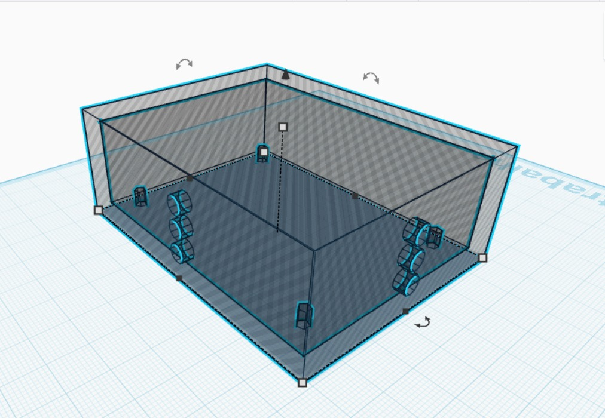

## Design 3D da estrutura mecânica

  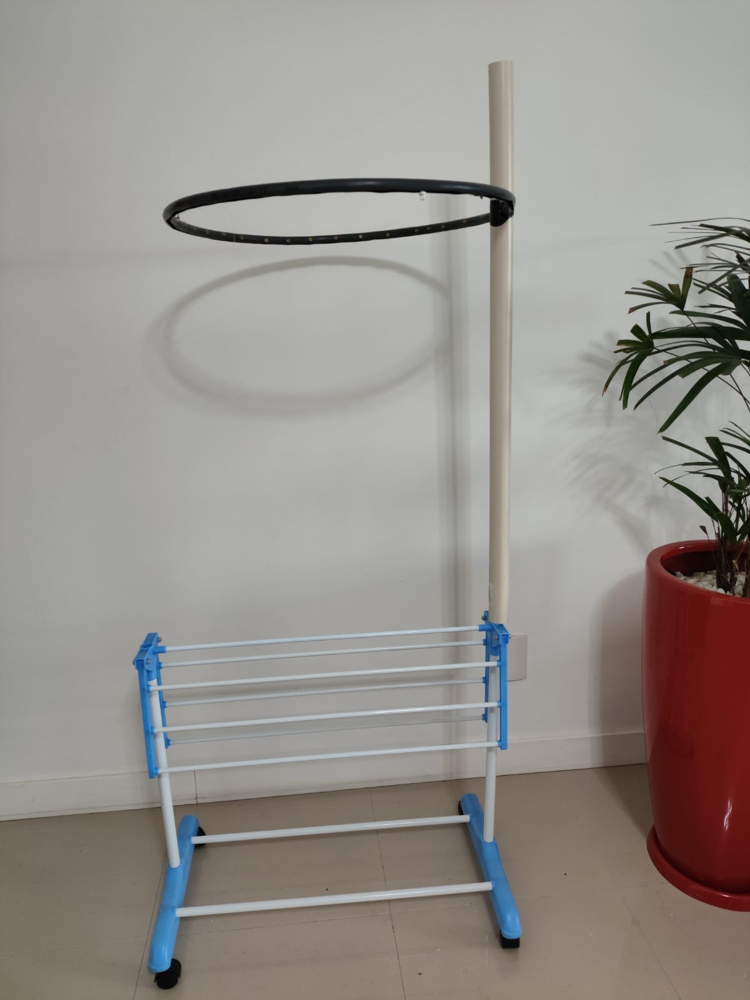

