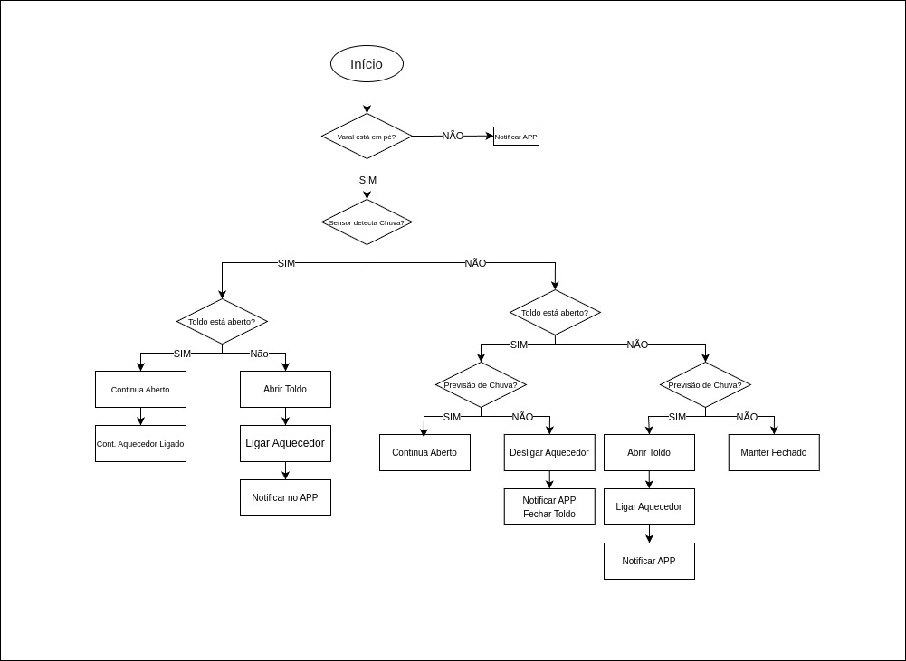
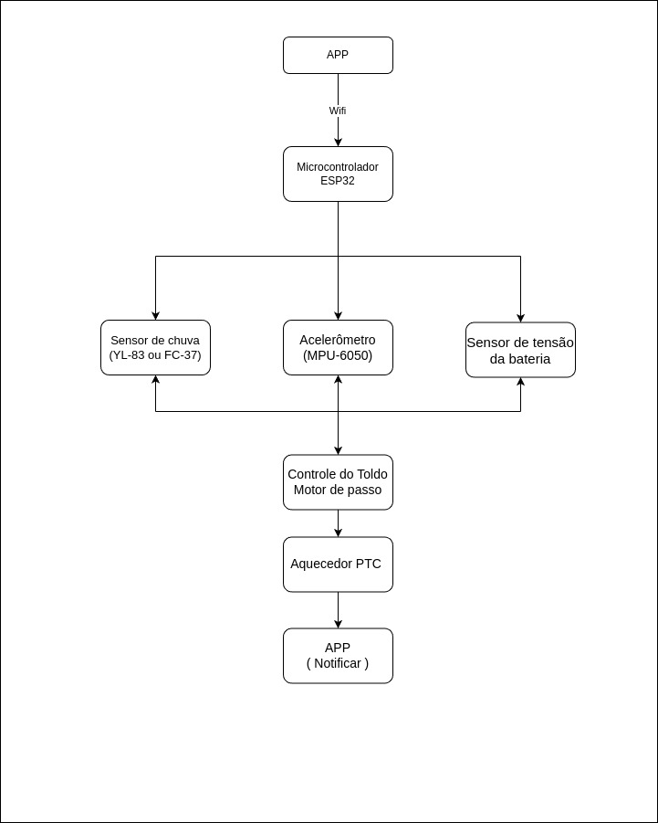
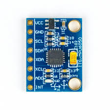

# PI3-2025-1

# DryShield

Alunos: Diana Macedo, Giovanna Liz, Sarah Bararua

## Resumo

Estender roupas em áreas externas é uma prática comum, porém altamente vulnerável às mudanças repentinas do clima. Muitos moradores enfrentam frustrações ao verem suas roupas molhadas por chuvas inesperadas, além do desgaste de precisar retirá-las às pressas ou reorganizar o varal repetidamente. Este projeto propõe uma solução automatizada e inteligente que visa minimizar esse transtorno, oferecendo um sistema capaz de proteger as roupas de forma autônoma e eficiente. A proposta combina monitoramento climático em tempo real e tomada de decisão automatizada, criando uma estrutura capaz de responder tanto à previsão do tempo quanto às condições ambientais detectadas no momento. Com isso, o sistema não apenas previne danos e retrabalhos, como também agrega praticidade, economia de tempo e conforto ao cotidiano dos usuários. O projeto se insere no contexto da automação residencial acessível, explorando conceitos de inteligência embarcada e conectividade para resolver um problema real com eficiência e simplicidade.

## Introdução

## Metodologia

## Fluxograma 

## Estudo sobre Aspectos de Inteligência
  
* Sensoriamento ambiental: uso de sensores de chuva para detectar mudanças nas condições climáticas em tempo real.

* Tomada de decisão automatizada: a lógica embarcada no microcontrolador avalia as condições do ambiente e da previsão do tempo para acionar mecanismos de proteção automaticamente, como o fechamento da tenda e o acionamento do aquecedor.

* Previsão de eventos: ao integrar uma verificação automática da previsão do tempo, o sistema antecipa situações de risco (como chuva iminente), aumentando a eficiência do controle.

* Conectividade e interação remota: o uso do módulo Wi-Fi permite controle via aplicativo, monitoramento em tempo real e possível integração com assistentes virtuais ou outros dispositivos IoT no futuro.

* Eficiência energética: o sistema só aciona dispositivos como o aquecedor quando necessário, otimizando o uso de energia e aumentando a vida útil dos componentes.

 ## Diagrama de Blocos do Sistema
 

 
 ## Sensores
  
  - Sensor de chuva YL-83: Detecta presença de água.
    
    
  - Acelerômetro (MPU-6050): Detecta quedas ou inclinações.
    
  
    
## Atuadores
    
- Motor de passo 28BYJ-48 : Vai ter a função de abrir e fechar o toldo.

- Aquecedor PTC 12V: Ativado após o fechamento para ajudar na secagem.
  
## Estrutura Mecânica
  
A estrutura consiste em um toldo retrátil, acionado por motor de passo com braços articulados ou trilhos. O varal é fixado de forma estável e sensores são posicionados para proteção contra água e detecção de anomalias.

  * Pra subir/descer:
Sistema de haste com parafuso sem fim (trapezoidal ou rosca normal):
O motor gira e empurra/recolhe uma haste que abre ou fecha a tenda.
Ideal pra controle preciso com motor de passo.

Sistema de polias e cabos (tipo persiana):
Motor gira um carretel que enrola/desenrola cabo de aço, puxando os braços do toldo.
Mais leve e fácil de implementar, mas exige tensionamento.

* Tecido da cortina:
Tecido blackout (resistente à água e ao sol, mas cuidado com calor).
Lona náutica (mais durável e resistente à umidade e vento).

Tecido Oxford com impermeabilização (leve e razoavelmente resistente).
  
## Definição do Processador
O ESP32 foi escolhido por ter Wi-Fi integrado, múltiplas interfaces GPIO, suporte a ADC e I2C, capacidade de processamento adequada e consumo energético eficiente.
